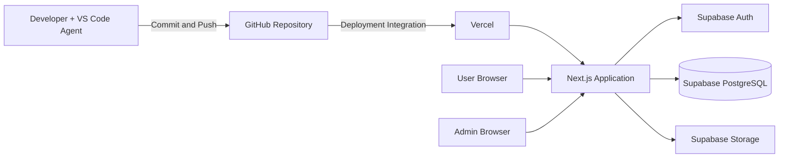
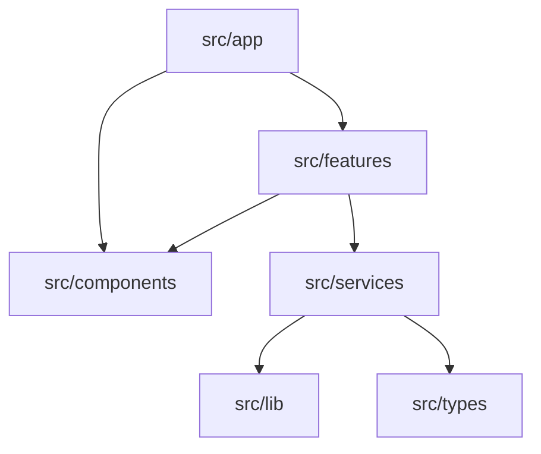

# Architecture

DiaMart sử dụng Next.js App Router, triển khai dự kiến trên Vercel, lưu dữ liệu và xác thực qua Supabase. Source code được quản lý trên GitHub.

## Thành phần chính

- Next.js App Router: tổ chức route trong `src/app`.
- Server Component: mặc định dùng cho UI không cần tương tác client.
- Client Component: chỉ dùng khi cần state, event handler hoặc browser API.
- Service layer: đặt data access hoặc business service trong `src/services` thay vì query trực tiếp trong UI component.
- Supabase: cung cấp Supabase Auth, Supabase PostgreSQL và Supabase Storage khi có nhu cầu.
- Admin dashboard: route `/admin` cho vận hành catalog (games, categories, products, FAQs, support topics) và upload ảnh.
- Environment variables: cấu hình public Supabase nằm trong `.env.local` ở local hoặc Vercel environment settings.

## System Flow

## Code Structure

## Deploy dự kiến

1. Developer commit và push thay đổi lên GitHub.
2. Vercel nhận thay đổi qua deployment integration.
3. Vercel build Next.js application.
4. Người dùng truy cập ứng dụng qua Vercel deployment.
5. Ứng dụng kết nối Supabase bằng environment variables phù hợp.

## Trạng thái hiện tại

- Chưa có module kinh doanh.
- Chưa có API bên ngoài.
- Phân quyền admin dựa trên `admin_users` + RLS `is_admin()`.
- Sơ đồ phải được cập nhật khi luồng hệ thống thay đổi.
