# Development Workflow

```mermaid
flowchart LR
    Requirement[Requirement]
    Analysis[Impact Analysis]
    Documentation[Feature Documentation]
    Branch[Feature Branch]
    Implementation[Implementation]
    Checks[Lint and Build]
    Preview[Vercel Preview]
    Review[Review]
    Main[Merge Main]
    Production[Production]

    Requirement --> Analysis
    Analysis --> Documentation
    Documentation --> Branch
    Branch --> Implementation
    Implementation --> Checks
    Checks --> Preview
    Preview --> Review
    Review --> Main
    Main --> Production
```



## Quy tắc

- Mỗi chức năng lớn dùng branch riêng.
- Không push thẳng thay đổi chưa kiểm tra lên `main`.
- Vercel Preview phải được kiểm tra trước khi merge nếu có thể.
- Database production không dùng làm nơi thử nghiệm.
- Migration đã chạy production không được sửa hoặc xóa; phải tạo migration mới.
- Secret chỉ nằm trong local environment hoặc Vercel/Supabase environment settings.
- Tài liệu phải được cập nhật trong cùng thay đổi với code liên quan.

## Quy ước branch

```text
feature/<feature-name>
fix/<bug-name>
refactor/<scope>
docs/<topic>
chore/<task>
```

## Quy ước commit

```text
feat:
fix:
refactor:
docs:
chore:
test:
```
